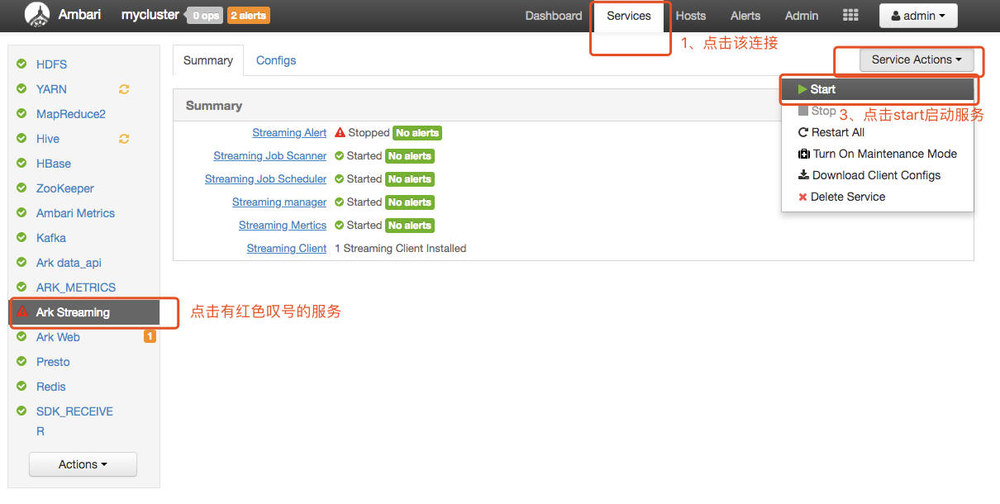
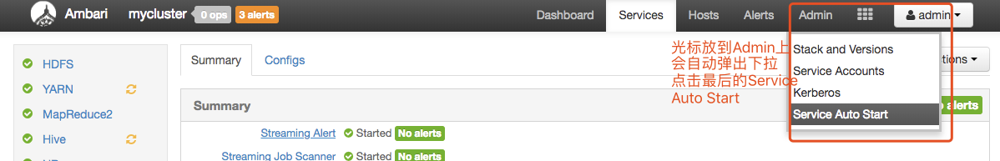
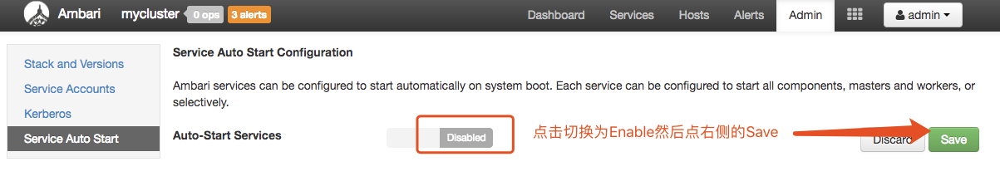
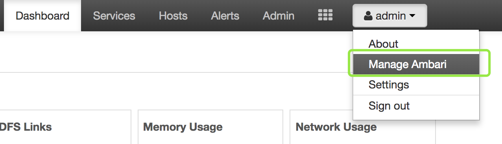
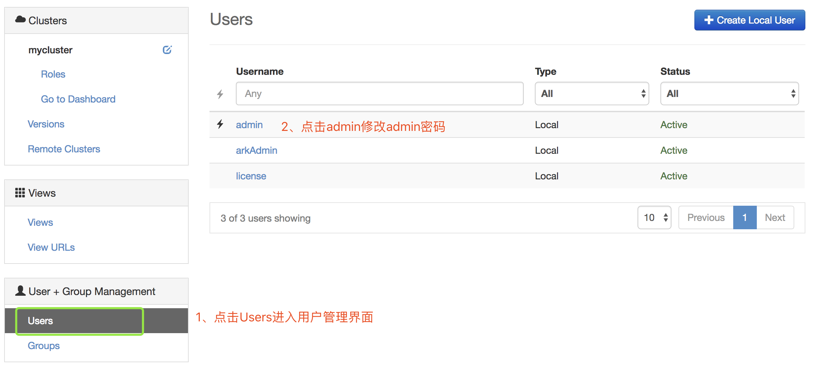

# argo-installer
方舟Argo安装脚本

---


# 1.1  方舟Argo远程自动化安装文档
# 一、环境准备

## 1.1  系统要求

方舟Argo安装部署手册的主要目的是指导手册使用该系统的用户方便快捷的安装系统和配置。
该文档指导用户自动安装。所有脚本地址在
https://github.com/analysys/argo-installer
如果您已经自己下载好了安装包，请使用《方舟产品单机离线部署文档》。

## 1.2 系统要求
| 系统及其组件          | 系统要求    | 
| ----------------       | :-----   | 
| 操作系统        | CentOS 7和 Redhat 7版本、强烈建议CentOS7.4|
| 磁盘目录        | 系统盘：一定要有/opt目录，而且空间大小不能小于300G;数据盘：如果有多块数据盘，要做raid，最终只识别/data1目录。单机版本建议做raid10| 
| 主机名          | 不能大写,不能有下划线"_"      |
| 系统编码        | UTF-8      |
| 软件环境        | 不支持混合部署|


## 1.3 网络要求

能连通外网

## 1.4 硬件要求

由于硬件服务器所装组件不一致,对系统资源的占用情况不尽相同，对硬件配置的要求也不一样，具体情况根据项目的硬件规划情况来。

## 1.5 安装包说明

standalone_remote_installer.sh 远程安装脚本

init_ext4.sh 环境检查脚本，检查环境是否有问题

# 二、集群安装

## 2.1 准备工作

1. 数据盘做raid10，挂载目录/data1下
2. 创建/opt/soft目录并把/opt/soft权限设置为777
3. 将standalone_remote_installer.sh文件拷贝到机器上/opt/soft目录下。
4. 将init_ext4.sh脚本拷贝到机器上/opt/soft目录，执行该脚本检查机器是否满足要求。

``` bash
sudo chmod -R 777 /opt/soft
sudo sh init_ext4.sh
```

## 2.2 配置/etc/hosts

1. 如果所有主机都已经有hostname，则直接进行第2步操作，如果没有配置，则需要给每台机器设置hostname

    1.1 登陆每台机器，执行
    ```bash
    hostname -f
    ```
    
    1.2 查看该机器的主机名,如果返回的结果是localhost，则说明该机器没有设置主机名。

    1.3 以root用户或sudo执行
    ```bash
    hostnamectl set-hostname ark1
    ```
    1.4 检查主机名是否设置成功：
    ```bash 
    hostname -f 
    ```
    命令查看返回值，如果是我们设置的主机名，主机名设置成功！

2. 配置/etc/hosts文件
```
${该机器的内网ip} ark1.analysys.xyz ark1 
```
注意，目前只支持 ark1.analysys.xyz，这个/etc/hosts文件也必须这么写

有3列内容，第一列为主机的ip地址，第二列是集群Ambari使用的FANQ格式的主机名,第三列是该ip对应的主机名。

保存后将该文件复制到所有机器的/etc目录下。

## 2.3 开始安装

###2.3.1 安装
以下操作以4.1.12版本为样例
配置服务器下载地址，修改config.properties
```bash
repo_url=argo-repo-url
```

```bash
mkdir /opt/soft
chmod 777 /opt/soft
sh standalone_remote_installer.sh install Grafana_123 4.1.12 centos7 root 'HJUiju)@)$' test_remote_installer  32 
```

| 参数 | 定义 |
| :--- | :--- |
| Grafana_123 | 你的mysql的root密码 |
| 4.1.12 | 你要安装的方舟的版本号 |
| centos7 | 你的操作系统的类型只支持centos6和centos7 |
| root | 安装用户，如果使用非root用户安装，要求这个用户必须有免密码sudo能力 |
| 'HJUiju)@)$' | 你使用的用户的密码 |
| test_remote_installer | 你这套环境名称，只能是英文字母和数字 |
| 32 | 你机器内存的大小，只支持32/64/128 |

_注意：该脚本不允许nohup后台执行，因为过程中会有询问您的操作的过程，所以请关注脚本的输出。_

在安装的过程中可以通过访问http://ark1.analysys.xyz:8080界面来查看安装细节，但请不要做任何操作。

等待脚本执行完成。

如果这一步安装报错或意外退出了终端，请参考《安装问题处理》文档


### 2.3.2 安装完成后，检查未成功启动的服务：

浏览器输入http://${该机器的内网ip}:8080

用户名密码默认为admin  admin

登陆进入后操作如下：

按上图中的1、2、3步骤操作完成，直到没有红色叹光的服务。另外需要注意的是，由于服务状态检查有一定的延时，所以在安装完成过几分钟后再进行该操作，操作完成后也需要观察一段时间再看结果。


###2.3.3 开启自动恢复功能，开启后，异常挂掉的服务会自己恢复重启

然后:

###2.3.4 修改Ambari管理员用户admin的密码

然后:

完成！

## 2.4 导入License

这一步骤的所有操作需要在**streaming**用户下执行，所以需要先切换到streaming用户。

开始导入license，依次执行如下命令
```bash
sudo su - streaming
/opt/soft/streaming/bin/init_license_info.sh 1 495D220F07341C03B1FC7CB4F25455227B29990C9B7511C26FEE4C76D72E1D14477CC6AD54741B8414DE9BF2B787351FA2E2F4FC9DF24F19FBDD4395BB2CC0A645FC2E9749DEA34A09FB58378D758E0A9903E2642F10FC464F5AF8D7A6AC41B31065A6D0CF2EE9FD1B047C5B40B24C76848C3568C3ACE24E3C48C5796E7CC585D4587CA5D4F3FC17F6C45C71426E4867DDA80A10D26E79E95DA2437DC72A428193B728B51A9D77914C7C5437C6CFD1B3
/opt/soft/streaming/bin/update_enterprise_code.sh wByeDrLc 1
```

## 2.5 初始化收数地址

SDK往方舟里上报数据，需要知道方舟收数的地址。默认情况下，可以使用 http://${该机器的外网ip}:8089 来上报数据，我们将该地址导入到方舟中。
```bash
/opt/soft/streaming/bin/init_data_entrance_url.sh http://${该机器的外网ip}:8089
```
但是IOS的SDK上报数据需要https，这种情况下，您需要单独部署一套nginx的机器，并配置域名访问。具体请参考文档：《部署前置nginx》


